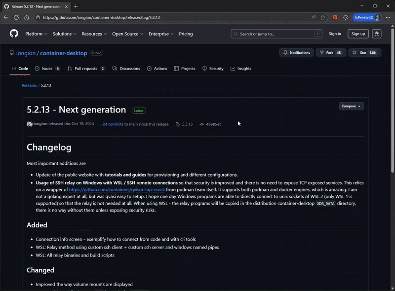

# View All Branches

A browser extension that automatically modifies the "Branches" link to the "All Branches" page.



## Motivation

Most of the time, I want to see the complete branch list rather than a subset filtered by some criteria. I found the default filtered views on GitHub to be more of a hindrance than a help. Since GitHub does not provide a built-in option to change this default behavior, I created this extension to automatically redirect to the "All Branches" view.

I've been using this extension personally for quite some time to streamline my daily workflow. Eventually, I expanded it to support Azure DevOps and GitLab as well, and decided to make it publicly available for other developers who maybe share the same preference.

Most of the code is vibe coded with GitHub Copilot and Claude Code, and sure it could be improved, but - it works (:

## Features

- **Multi-Platform Support**: Works seamlessly on GitHub, Azure DevOps, and GitLab (including custom domains).
- **Dynamic Content Support**: Uses a `MutationObserver` to detect and update links that are loaded dynamically, such as the branches dropdown in GitHub and header navigation in Azure DevOps.
- **Configurable Settings**: Enable/disable functionality per platform through the popup interface.
- **Minimalist UI**: A clean and simple popup for managing settings.
- **Debug Logging**: Optional console logging for troubleshooting.

## Installation

To install the extension locally in a Chromium-based browser (like Google Chrome or Microsoft Edge), follow these steps:

1. Clone this repository:
   ```bash
   git clone https://github.com/jurakovic/view-all-branches.git
   ```
2. In your browser, navigate to `chrome://extensions` or `edge://extensions`
3. Enable "Developer mode" in the top right
4. Click "Load unpacked" and select the `src` folder from this repository

> See more details [here](https://developer.chrome.com/docs/extensions/get-started/tutorial/hello-world#load-unpacked).

## Roadmap

- Add support for additional platforms.
- Publish the extension to the Chrome Web Store and Microsoft Edge Add-ons for easier installation.
- Port the extension to Firefox and other browsers.

## License

MIT
